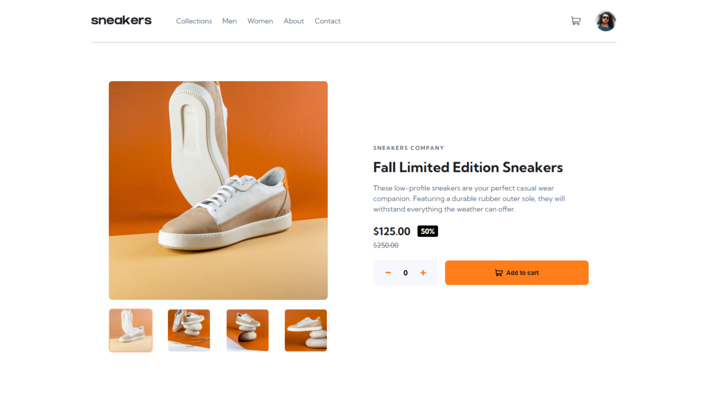

# Frontend Mentor - Solução para a página de produto de e-commerce

Esta é uma solução para o desafio [E-commerce product page challenge on Frontend Mentor](https://www.frontendmentor.io/challenges/ecommerce-product-page-UPsZ9MJp6).

## Sumário

- [Visão geral](#visao-geral)
  - [O desafio](#o-desafio)
  - [Screenshot](#screenshot)
  - [Links](#links)
- [Meu processo](#meu-processo)
  - [Construído com](#construído-com)
  - [O que aprendi](#o-que-aprendi)
  - [Desenvolvimento contínuo](#desenvolvimento-contínuo)
- [Autor](#autor)

## Visão geral

### O desafio

Os usuários devem conseguir:

- Visualizar o layout ideal do site dependendo do tamanho da tela do dispositivo
- Ver os estados de hover em todos os elementos interativos da página
- Abrir a galeria (lightbox) ao clicar na imagem principal do produto
- Alternar a imagem principal clicando nas miniaturas
- Adicionar itens ao carrinho
- Visualizar o carrinho e remover itens dele

### Screenshot



### Links

- Solução no Frontend Mentor: [Ver solução](https://your-solution-url.com)
- Site online (deploy): [Acessar site](https://your-live-site-url.com)

## Meu processo

### Construído com

- HTML5 semântico e CSS
- JavaScript
- Mobile-first workflow

### O que aprendi

Durante esse projeto consegui evoluir bastante em JavaScript, especialmente em manipulação de dados e interação com o DOM.

- Aprendi a utilizar atributos data- para acessar e manipular informações diretamente no JavaScript, tornando o código mais organizado e fácil de manter.
- Consegui implementar a lógica de troca da imagem principal do produto usando getAttribute, permitindo que a imagem exibida mude conforme a miniatura clicada pelo usuário.

Exemplo do que desenvolvi:
```js
const updateImage = (index) => {
  thumbnails.forEach((thumb) => thumb.classList.remove("active"));
  thumbnails[index].classList.add("active");

  const newImageSrc = thumbnails[index].getAttribute("data-main");
  mainImage.src = newImageSrc.replace("-thumbnail", "");

  currentImageIndex = index;
};

thumbnails.forEach((thumbnail, index) => {
  thumbnail.addEventListener("click", () => {
    updateImage(index);
  });
});
```
Esse aprendizado me ajudou a entender melhor como trabalhar com eventos, atributos HTML personalizados e atualização dinâmica de elementos.

### Desenvolvimento contínuo

Quero continuar evoluindo em:

- Melhorar acessibilidade
- Praticar animações em CSS/JS para transições mais suaves
- Evoluir esse projeto para React no futuro

## Autor

- Frontend Mentor - [@jamillyferreira](https://www.frontendmentor.io/profile/jamillyferreira)
- LinkedIn - [@jamillyferreira](https://www.linkedin.com/in/jamillyferreira/)
- GitHub - [jamillyferreira](https://github.com/jamillyferreira)
